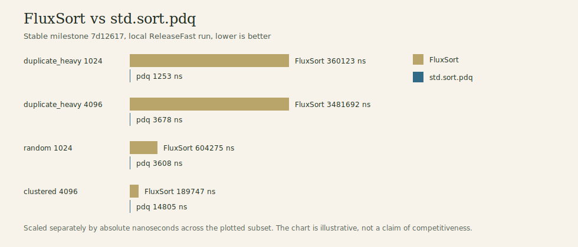
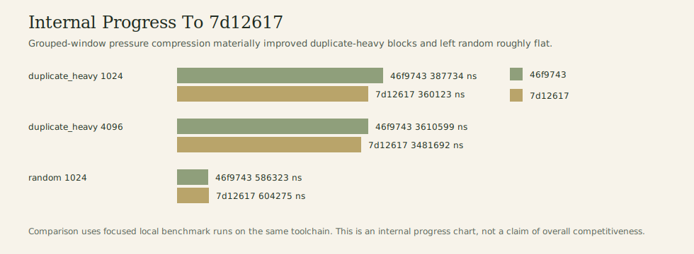

# FluxSort

FluxSort is an experimental integer sorting algorithm in Zig built around exact local transport guided by a weighted 2-adic pressure field.



## Status

- Experimental and research-oriented.
- Exact as implemented: accepted transport moves are energy-checked, and odd-even cleanup is the correctness backstop.
- Not shown to be competitive with mainstream baselines such as `std.sort.pdq` in the tested regimes.
- Preserves the best stable implementation milestone at `7d12617` (`compress grouped-window pressure computation`).

This repository is worth reading as an algorithm experiment, benchmark trail, and negative-results record - not as a recommendation for production sorting.

## Algorithm Sketch

FluxSort sorts signed integers with four core ideas:

1. Convert signed integers to order-preserving biased unsigned keys.
2. Compute a local pressure field inside each block from nearby comparisons.
3. Propose bounded local transport moves from that pressure field.
4. Accept a move only if it strictly decreases exact weighted inversion energy.

The weighting is based on capped 2-adic closeness: pairs with larger `ctz(x xor y)` receive larger inversion weight. Cleanup is then performed with exact odd-even adjacent inversion passes until the array is sorted.

In short:

- pressure is local,
- transport is bounded and stable-targeted,
- acceptance is exact and energy-based,
- cleanup guarantees completion.

## What Actually Worked

The strongest optimization line was grouped duplicate-heavy handling.

- Low-cardinality duplicate-heavy blocks can be compressed into exact value groups.
- The current stable milestone fuses grouped-window pressure and grouped baseline energy on that path.
- That change materially improved duplicate-heavy datasets relative to earlier revisions.

Representative stable numbers from `7d12617`:

| Dataset | Size | Pre-`7d12617` | `7d12617` | Change |
| --- | ---: | ---: | ---: | ---: |
| `duplicate_heavy` | 1024 | 387734 ns | 360123 ns | -7.1% |
| `duplicate_heavy` | 4096 | 3610599 ns | 3481692 ns | -3.6% |
| `random` | 1024 | 586323 ns | 604275 ns | +3.1% |
| `random` | 4096 | 4399906 ns | 4352358 ns | -1.1% |



That is the one optimization milestone I would treat as clearly real.

## What Did Not Pay Off

This repository intentionally keeps the failures visible instead of smoothing them over. Major explored directions included:

- residue-tree / residue-compressed energy engines
- frontier or low-breakpoint repair kernels
- cohort / segment transport variants
- generic signature-bucket pressure compression
- persistent block-field reuse across rounds
- flux and distributed-flux transport solvers
- active-block and overlapping-window schedulers
- grouped-first low-cardinality specialist mode
- sparse-edit exact repair mode for already-sorted arrays

Only the grouped duplicate-heavy pressure path landed. The rest were benchmarked, found wanting, and intentionally rejected.

See `docs/findings.md` for the condensed research trail.

## Benchmark Summary

The current stable implementation does not beat the standard-library baseline on the representative full-sort cases below.

| Dataset | Size | FluxSort | `std.sort.pdq` |
| --- | ---: | ---: | ---: |
| `duplicate_heavy` | 1024 | 360123 ns | 1253 ns |
| `duplicate_heavy` | 4096 | 3481692 ns | 3678 ns |
| `clustered` | 1024 | 48119 ns | 2862 ns |
| `clustered` | 4096 | 189747 ns | 14805 ns |
| `random` | 1024 | 604275 ns | 3608 ns |
| `random` | 4096 | 4352358 ns | 45065 ns |
| `sorted` | 1024 | 680 ns | 336 ns |
| `sorted` | 4096 | 2340 ns | 1199 ns |

Interpretation:

- FluxSort has a meaningful internal optimization story.
- It does not have a competitive benchmark story against strong mainstream baselines.
- The grouped duplicate-heavy path is interesting as an algorithm-specific milestone, not as evidence of overall speed.

For tables, commands, and caveats, see `docs/benchmark-summary.md`.

## Why Publish It Anyway?

Because it is still a useful artifact:

- unusual 2-adic weighting and local transport design
- exact acceptance instead of heuristic local swaps alone
- extensive correctness/property testing
- clear benchmark trail with negative results preserved
- compact Zig codebase for studying a nonstandard sorting idea end to end

## Build, Test, Benchmark

Build:

```sh
./.toolchain/zig-0.14.1/zig build
```

Test:

```sh
./.toolchain/zig-0.14.1/zig build test
```

Benchmark harness:

```sh
./.toolchain/zig-0.14.1/zig build bench -Doptimize=ReleaseFast
```

Focused benchmark example:

```sh
./.toolchain/zig-0.14.1/zig build bench -Doptimize=ReleaseFast -- --datasets=duplicate_heavy,random,clustered,sorted --sizes=1024,4096 --iterations=400
```

## Basic Usage

```zig
const fluxsort = @import("fluxsort");

var xs = [_]i64{ 9, -3, 4, 4, 0, -9, 7 };
fluxsort.sort(i64, xs[0..]);
```

With explicit configuration:

```zig
const cfg = fluxsort.Config{
    .block_size = 32,
    .valuation_cap = 8,
    .neighborhood = 8,
    .max_displacement = 4,
    .transport_rounds = 4,
};

fluxsort.sortWithConfig(i64, xs[0..], cfg);
```

`cleanup_pass_limit` remains available for diagnostic runs; leaving it as `null` preserves the exactness guarantee.

## Repository Layout

- `src/fluxsort.zig` public API
- `src/core/` pressure, energy, transport, cleanup, and configuration code
- `test/` unit and property tests
- `bench/main.zig` local benchmark harness
- `docs/findings.md` condensed research trail
- `docs/benchmark-summary.md` benchmark notes and cited runs

## Final Assessment

FluxSort is an interesting experimental generic integer sorting algorithm with one meaningful optimization milestone and a substantial trail of tested ideas. It is exact, unusual, and reasonably well-documented. It has not been shown to beat relevant baselines, and this repository should be read as a research artifact rather than a production sorting library.
